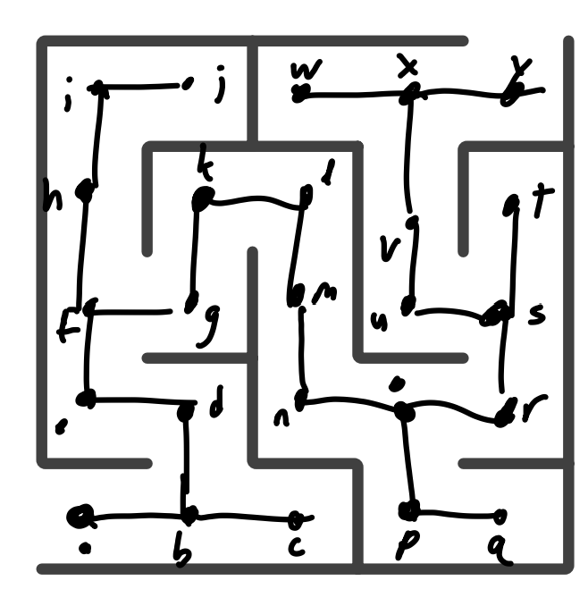

# Question 1

## 1a: $K_5$
Complete  
Simple  
Connected  
Cyclic  
Unweighted  
Undirected  

## 1b
Tree (unrooted)  
Simple  
Connected  
Acyclic  
Unweighted  
Undirected  
Planar  

## 1c 
Not Connected  
Cyclic  
Weighted  
Undirected  
Planar  

## 1d
Connected  
Tree (unrooted)  
Acyclic  
Weighted  
Directed   
Planar  
DAG

# Question 2:
$$
\begin{bmatrix}
0&1&1&1&0\\
0&0&1&0&0\\
0&0&0&1&0\\
0&0&0&0&1\\
0&0&0&0&0\\
\end{bmatrix}
$$
`adj[1][4]` is 1, as there exists an edge from 1 to 4. I did not put 2, as that might indicate a weighted graph.

# Question 3:
A trail cannot repeat edges, but a walk can.  
The walk $b,c,b,c,d$ repeats the edge $(c,d)$, so it is not a trail.

# Question 4:
A path cannot repeat nodes, but a trail can. A trail cannot repeat edges, but a path can.
The trail $b,e,f,e,d$ repeats the vertex $e$, but uses different edges. This makes it a trail but not a path.

# Question 5:
A path from b to d is $b,c,d$. This path does not repeat nodes.

# Question 6:
A path cannot repeat nodes, but a trail can. A trail cannot repeat edges, but a path can.
The trail $b,e,f,e,d$ repeats the vertex $e$, but uses different edges. This makes it a trail but not a path.

# Question 7
Here is an image of the maze with the associated graph drawn on top of it.  


# Question 8:
Depth-first search is implemented in `homework1.py`. I solved the maze with the path:  
```
(0,0), (1,0), (1,1), (0,1), (0,2), (1,2), (1,3), (2,3), (2,2), (2,1), (3,1), (4,1), (4,2), (3,2), (3,3), (3,4), (4,4)
```
# Question 9:
Breadth-first search is implemented in `homework1.py`. I found the shortest path to checkmate to be: 
```
g2g4, e7e6, f2f3, d8h4
```
